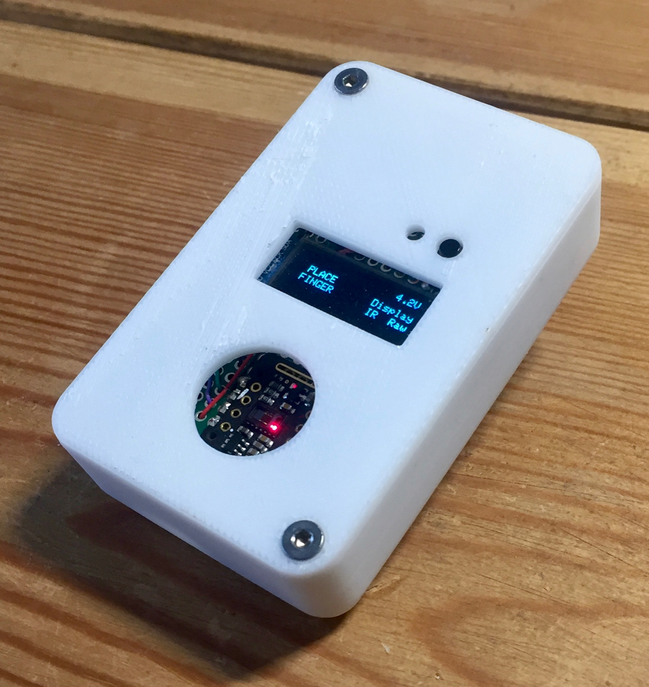
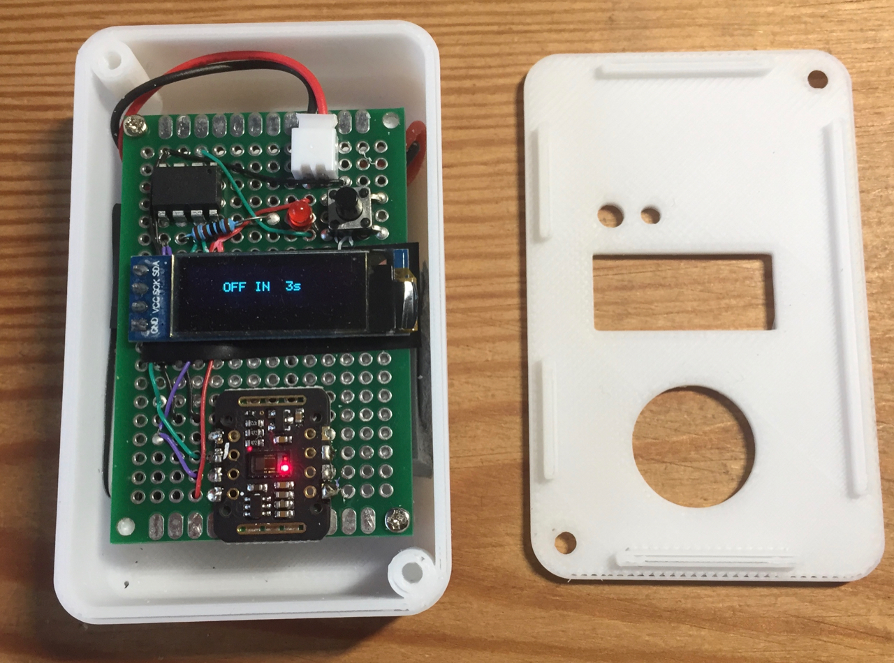

# tinyPulsePPG - 3d printed case

The directory contains the STL files for the top and bottom of the case and the OpenScad used to generate them. 
You will need to adjust the Heigh of the case and the BoardHeight to fit your board and battery. The board pictured below is lower profile than the original versio (8mm).

